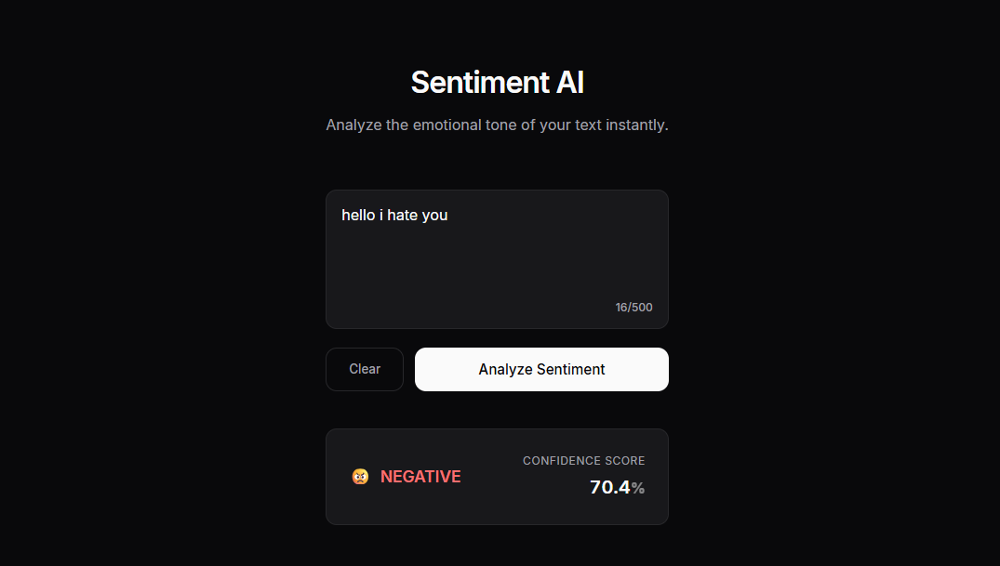

## 🧠 AI Sentiment Analyzer


A full-stack web app that classifies text as **positive** or **negative** in real time using a custom fine-tuned DistilBERT model.

This project does not rely on a third-party sentiment API. The model was trained, exported, and deployed by the developer. Model weights are hosted on Hugging Face and loaded dynamically by the backend to keep the repository small and easy to run.



---

## 🏗️ Architecture

The system follows a hybrid cloud setup:

1. **Frontend (React + Vite)**
   A fast, responsive UI written in TypeScript.

2. **Backend (FastAPI)**
   A Python API that handles inference and model loading.

3. **AI Model (Hugging Face Hub)**
   The backend downloads and caches the trained DistilBERT weights on startup, allowing consistent results across environments.

---

## 🛠️ Tech Stack

### Frontend

* React (Vite)
* TypeScript
* CSS Modules / plain CSS

### Backend

* FastAPI (Python 3.10+)
* Uvicorn
* PyTorch
* Transformers
* Hugging Face Hub

---

## 🚀 Getting Started

### Prerequisites

* Node.js v16+
* Python v3.9+

---

### 1. Clone the Repository

```bash
git clone <repository-url>
cd AI-Sentiment-App
```

---

### 2. Set Up the Backend

```bash
cd server

# Create virtual environment
python -m venv venv

# Activate (Windows)
venv\Scripts\activate

# Activate (Mac/Linux)
# source venv/bin/activate

# Install dependencies
pip install fastapi uvicorn transformers torch

# Start the API
uvicorn api:app --reload
```

Wait until the terminal shows:

```
✅ Model loaded!
```

---

### 3. Set Up the Frontend

```bash
cd client

# Install dependencies
npm install

# Start the development server
npm run dev
```

Open your browser at:
`http://localhost:5173`

---

## 🎯 Features

* Real-time sentiment prediction
* Custom fine-tuned DistilBERT model
* Clean API separation between UI and ML logic
* Lightweight repository with cloud-hosted model weights

---


